<div align="center">

<h3><code>divesh@github ~ $ whoami</code></h3>

<table>
<tr>
<td valign="top"></td>
<td valign="top"></td>
</tr>
</table>

[](https://projects-nine-woad.vercel.app/)
[](https://linkedin.com/in/diveshjadhav8766)
[](mailto:diveshjadhav72@gmail.com)

</div>

---

<h3><code>divesh@github ~ $ cat experience.md</code></h3>

**Software Development Engineer** · services booking & payments platform · *Apr 2026 — Present*

- Built the customer-facing web app from an empty repo — frontend architecture, design system and release quality are mine to own.
- Authored custom **Claude AI skills** covering the design system, design patterns, FTUX and PR review, so generated code follows team conventions instead of fighting them — **40% faster feature development**.
- Integrated **Stripe Terminal S710** and Bluetooth card readers into an end-to-end checkout, adding in-person card and Tap to Pay.
- Shipped a **waitlist** that fills cancelled slots automatically — **+35% bookings, −80% idle appointment slots**.
- Built a **form builder** for client intake forms and reusable service templates — **−80% manual setup time**.

**Application Engineer** · KYC registry platform · *Sep 2025 — Mar 2026*

- Led frontend for a team of 4 — architecture, code quality, end-to-end delivery.
- Designed application-wide **RBAC**, reusable form components, and embedded **Apache Superset** dashboards.
- **−70% initial page load** via lazy loading and code splitting.

**Application Engineer** · capital markets trading platform · *Jul 2023 — Aug 2025*

- Reusable React + TypeScript components and dynamic forms with React Hook Form — **−35% development time**.
- **−60% API calls**, **−30% bundle size** through lazy loading, code splitting and caching.
- **Web Workers**, Service Workers and virtualised infinite scroll — **+40% load speed, −80% UI freezes**.
- Real-time market KPI dashboards with Chart.js across 5+ modules, to **WCAG 2.1 AA**.
- **+40% unit test coverage** with Jest and React Testing Library.

---

<h3><code>divesh@github ~ $ ls -la projects/</code></h3>

| | Project | What it does | Built with |
| :-- | :-- | :-- | :-- |
| 🔗 | **Blockchain Certificate Verification** | Decentralised certificate issuance and verification — Solidity contracts on an Ethereum testnet hold tamper-proof records for 100+ certificates, with MetaMask auth and automated issuance cutting manual effort by 80%. | `React` `Solidity` `IPFS` `Ethereum` `Tailwind` |
| 🎓 | **StudyNotion — EdTech Platform** | Full-stack MERN learning platform with JWT auth, role-based instructor dashboards, Razorpay payments and Cloudinary media. | `MongoDB` `Express` `React` `Node` |
| 🎨 | **This profile** | Every panel above is an SVG my own Python scripts generate, refreshed daily by a GitHub Action. No third-party stats widgets. | `Python` `SVG` `GitHub Actions` |

---

<div align="center">

<h3><code>divesh@github ~ $ ./contributions.sh</code></h3>



<sub>Day job ships to private company repos, so this graph undercounts by a lot — the shipped work is in the panels above.</sub>

</div>

---

<h3><code>divesh@github ~ $ cat status.txt</code></h3>

> **Open to opportunities** — frontend / full-stack roles where performance, design systems and shipping quickly all matter.
>
> 📧 [diveshjadhav72@gmail.com](mailto:diveshjadhav72@gmail.com) · 💼 [LinkedIn](https://linkedin.com/in/diveshjadhav8766) · 🌐 [Portfolio](https://projects-nine-woad.vercel.app/)

<details>
<summary><code>divesh@github ~ $ cat how-this-readme-works.md</code></summary>

<br>

Nothing here is a hosted widget. Three Python scripts emit three self-contained animated SVGs, and a GitHub Actions cron keeps them current:

| Script | Produces | Animation |
| :-- | :-- | :-- |
| `scripts/fetch_contributions.py` | `data/contributions.json` | — scrapes the public contribution calendar, no token needed |
| `scripts/render_heatmap_svg.py` | `contrib-heatmap.svg` | cells pop in on a diagonal wave; peak days keep a slow glow |
| `scripts/make_info_card.py` | `info-card.svg` | neofetch rows slide in on a stagger |
| `scripts/make_photo_panel.py` | `divesh-photo.svg` | the headshot wipes in top-to-bottom; JPEG inlined as a data URI |
| `scripts/make_ascii_svg.py` (from `assets/portrait.png`) | `divesh-ascii.svg` | each ASCII row wipes in left-to-right via a SMIL clip |

The same portrait also renders as an ASCII grid, which is where this started:

<div align="center">

</div>

A 370px panel needs roughly 6px per glyph to stay legible, which caps the grid
at 64 columns — about 2,700 characters across a 13-step density ramp. Enough to
read as a person, not enough to be a likeness, so the panel up top uses the
photograph and this stays a demo. Letter ramps (`DIVESH`) are worse again:
every glyph carries similar ink, so the tonal range collapses.

GitHub strips `<script>` and sanitises inline CSS in READMEs — but it renders SVG loaded through ``, and CSS keyframes plus SMIL inside those SVGs run fine. That's the whole trick.

Rebuild locally:

```bash
pip install -r scripts/requirements.txt
python scripts/fetch_contributions.py
cd scripts && python render_heatmap_svg.py && python make_info_card.py && python make_ascii_svg.py
```

The portrait grid is committed, so CI never touches it. To rebuild it from a different photo:

```bash
pip install -r scripts/requirements-portrait.txt
python scripts/prep_photo.py my-photo.jpg        # -> assets/portrait.png
python scripts/make_photo_panel.py my-photo.jpg  # -> divesh-photo.svg
cd scripts && python make_ascii_svg.py
```

`prep_photo.py` uses `rembg` when it's installed and otherwise keys out a flat
studio backdrop in LAB space, so `pip install opencv-python-headless` alone is
enough — pass `--no-rembg` to force the lighter path.

Approach adapted from [Avi Vashishta's animated profile README guide](https://www.avivashishta.com/blog/build-animated-github-profile-readme.html).

</details>
