<h3><code>divesh@github ~ $ ./contributions.sh</code></h3>

  

<h3><code>divesh@github ~ $ whoami</code></h3>

<table>
<tr>
<td valign="top"></td>
<td valign="top"></td>
</tr>
</table>

---

<h3><code>divesh@github ~ $ git log --oneline --reverse</code></h3>

> 

> 
<b>Software Development Engineer</b> &middot; services booking &amp; payments platform &middot; <i>Apr 2026 — Present</i> &middot; <code>6 mo</code>

>
> `React` `TypeScript` `Stripe Terminal` `Design Systems` `Claude Skills`
>
> - Built the customer-facing web app from an empty repo — frontend architecture, design system and release quality are mine to own.
> - Authored custom **Claude AI skills** covering the design system, design patterns, FTUX and PR review, so generated code follows team conventions instead of fighting them — **40% faster feature development**.
> - Integrated **Stripe Terminal S710** and Bluetooth card readers into an end-to-end checkout, adding in-person card and Tap to Pay.
> - Shipped a **waitlist** that fills cancelled slots automatically — **+35% bookings, −80% idle appointment slots**.
> - Built a **form builder** for client intake forms and reusable service templates — **−80% manual setup time**.
>
> 

> 

> 
<b>Application Engineer</b> &middot; KYC registry platform &middot; <i>Sep 2025 — Mar 2026</i> &middot; <code>7 mo</code>

>
> `React` `RBAC` `Apache Superset` `Code Splitting`
>
> - Led frontend for a team of 4 — architecture, code quality, end-to-end delivery.
> - Designed application-wide **RBAC**, reusable form components, and embedded **Apache Superset** dashboards.
> - **−70% initial page load** via lazy loading and code splitting.
>
> 

> 

> 
<b>Application Engineer</b> &middot; capital markets trading platform &middot; <i>Jul 2023 — Aug 2025</i> &middot; <code>2y 2m</code>

>
> `React` `TypeScript` `React Hook Form` `Web Workers` `Chart.js` `Jest`
>
> - Reusable React + TypeScript components and dynamic forms with React Hook Form — **−35% development time**.
> - **−60% API calls**, **−30% bundle size** through lazy loading, code splitting and caching.
> - **Web Workers**, Service Workers and virtualised infinite scroll — **+40% load speed, −80% UI freezes**.
> - Real-time market KPI dashboards with Chart.js across 5+ modules, to **WCAG 2.1 AA**.
> - **+40% unit test coverage** with Jest and React Testing Library.
>
> 

---

<h3><code>divesh@github ~ $ cat skills.json</code></h3>

---

<h3><code>divesh@github ~ $ ls -la projects/</code></h3>

---

<h3><code>divesh@github ~ $ ./connect.sh</code></h3>

 

Building something, or just want to argue about render budgets and design tokens? My inbox is open.

Navi Mumbai, India · IST (UTC+5:30)

